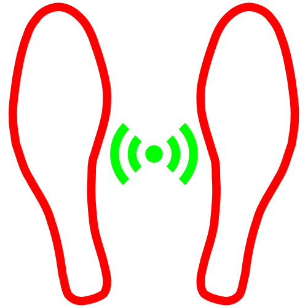

# Feet  Back

A sensory prosthesis for the feet.

## Purpose

This project aims to develop a sensory prosthesis for the foot.
The target group is people with limited perception of their feet as a result of paralysis or illness.

And people who are looking for ways to develop synaesthetic applications. 

## How it works

The pressure under the feet is recorded by sensors and output as feedback through vibrations at sensitive body parts. Like arm wrist, neck, etc.

Sensor -> App -> Actor

### Details

Bluetooth low energy devices are connected via the app. Continuous reading of the sensors, evaluation and output to actuators is the main mode of operation. 

## Parts

* 2 pressure resistive insoles
* 2 fitness tracker with vibrations
* 1 smartphone

## Framework

Flutter

## Platforms

* Android, min SDK 21 (Android 5)

## Supported Devices

### Actors

Currently only one device is supported. The code base is prepared to add more.

#### MPOW DS-D6

Available on eBay and other stores.

*MPOW DS-D6 Fitness Tracker*

This device is well known from other reverse engineering projects. No customized firmware is required for this purpose. The essential function is vibration. Three vibration pulses of different lengths can be sent. The two pulses with the minimum and maximum length are used to represent two different regions on the foot.

### Sensors

Currently are two devices supported. One is still under development and the other is not always available in the EU.

#### FSRTEK - under development

Piezo resistive insole with 12 sensor points. 

[Wearable FSR Sensor](https://www.fsrtek.com/flexible-gait-analysis-piezoresistive-insole-force-sensitive-resistor)

*FSRTEK flexible gait analysis piezoresistive insole - prototype*

This device is **fully** supported.

Thanks to the support from this company.

#### SALTED

Piezo resistive insole with 4 sensor points, vibration output.

[SALTED Golf Insoles](https://en.salted.shop/#none)

*SALTED Golf insoles*

This device is **partly** supported.

This sensor was integrated by reverse engineering. 
So far following tasks are working:
* Connect
* Switch on Notify
* Interpret values - wip

Not working
* Vibration output (turn vibration on is working, off sequence is unknown)

Due to the high price of this product, only the necessary functions were researched. The hcidump of the original app was evaluated for this purpose. The connection setup and the start/stop commands for notify are known.
No try and error attempt was made due to the risk of bricking the device

The original transmission protocol is unknown. About 80% of the incoming values cannot be used, because of their static behavior. This means  The detected sensor values are in a narrow range. In addition, a change in the value range appears to occur from a certain pressure. This jump has not yet been systematically recorded and interpreted. Any help on this topic is very welcome.

## Models

### Connection

Inside *BluetoothConnectionModel* everything ble related is handled. Special ble commands are stored inside the *PeripheralConstants*.

### Parsing

The incoming ble notify values are converted to sensor values in the SensorStateModel. For uniform use of different sensor types, the sensor values are normalized to the range from 0 to 1.

### Transmission

The *TransmissionHandler* listens for incoming sensor values and writes to the actor devices. The timing and selection of write commands is orchestrated using the *FeedbackModel*.

### Feedback

The goal of generating dynamic haptic feedback can only be realized to a limited extent with the available actuators. The manufacturer's firmware of the mpow dsd6 fitness trackers only allows three different vibration impulses: short, medium and long. The first and last pulses are used for local differentiation between the front and rear foot area. The pressure intensity is represented by the intervals between the pulses. The greater the pressure, the shorter the intervals. For this approach, the normalized sensor values are mapped to time values. These are used to control timers in order to send commands to the actuators above a certain threshold value.
As complicated as this implementation sounds, as poor is the current result. Further revisions are necessary in this area.

## Screenshots

**Sensor Insoles Widget**

**Realtime Chart Widget**

**Feedback Settings**

**Heatmap Widget**

**Balance Widget**

